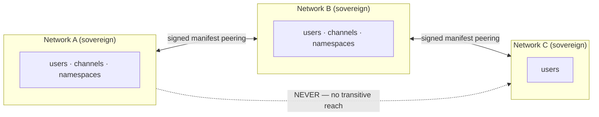
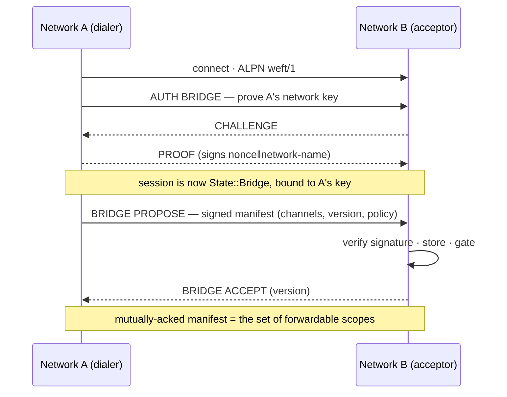
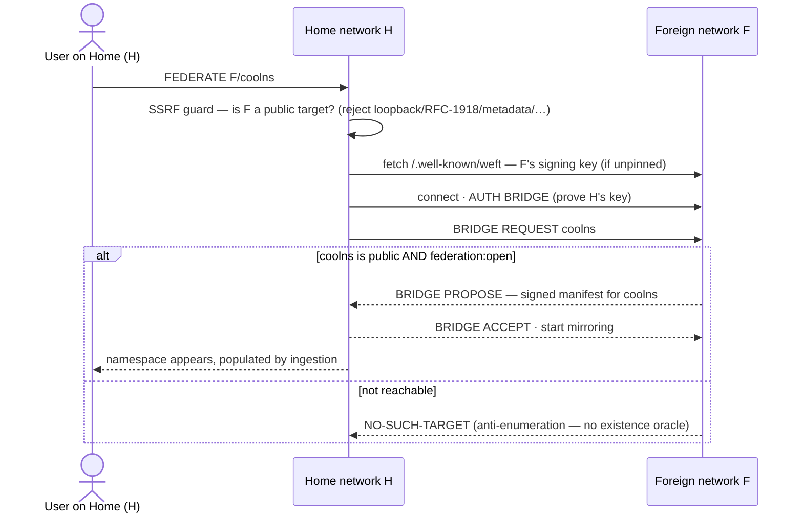
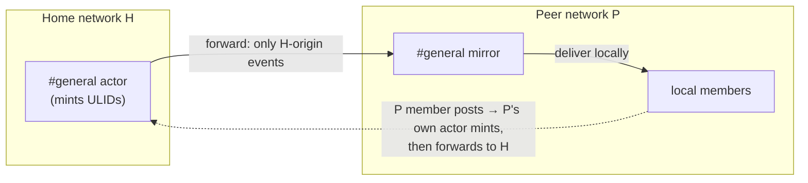
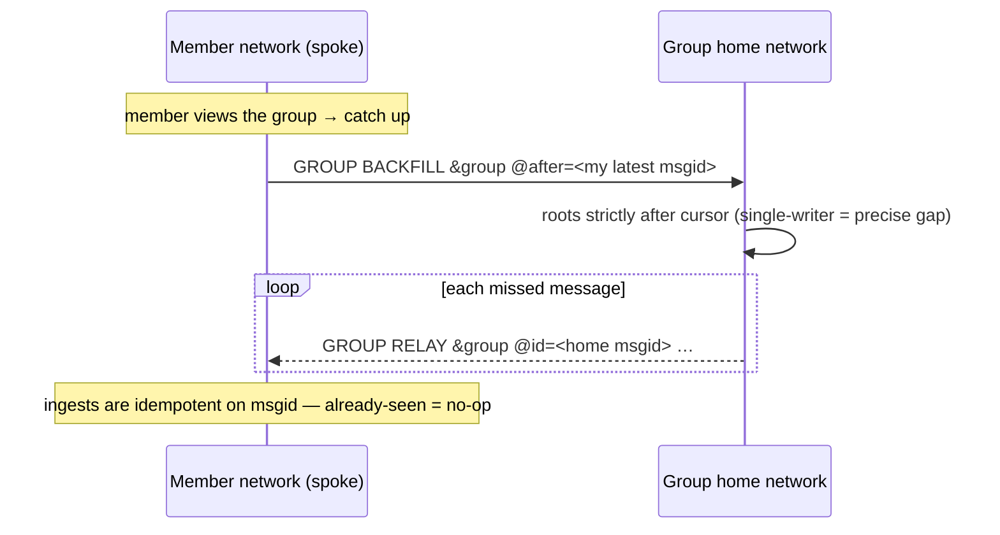
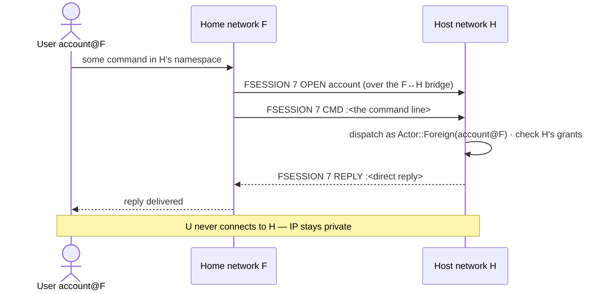
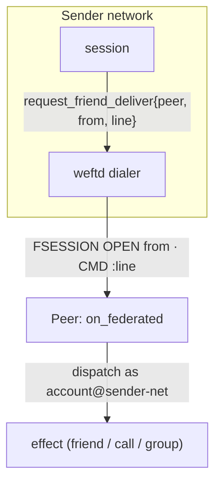
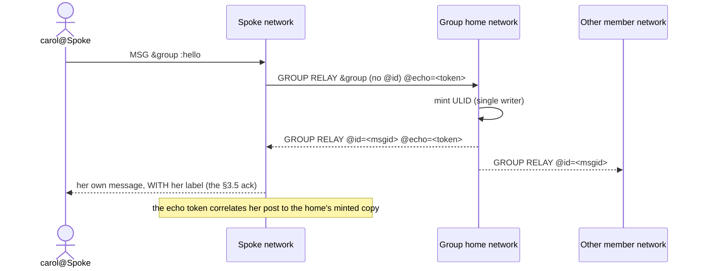
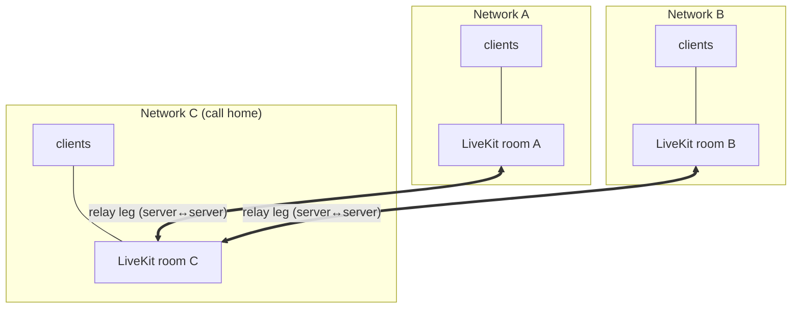
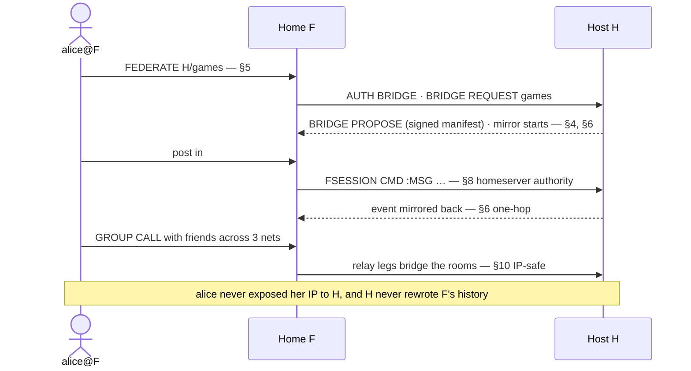

# WEFT Federation Flows

*Conceptual companion to `weft-protocol-spec.md` (§11, §11.10, §16). This document
explains **how two sovereign WEFT networks talk to each other** — the tunnels they
open, what rides each one, and the guarantees that hold at every hop. It is a map,
not a wire reference: for exact line syntax see the spec; for the whole single-network
protocol see `weft-protocol-flows.md`.*

---

## 1. The one-paragraph model

Every WEFT network is **sovereign**. There is no global namespace, no root of trust,
no transitive reach. Two networks become aware of each other only through an
**explicit, signed peering** — and even then, an event travels **at most one hop from
its origin**. A message that started on network `A` may be mirrored onto `B` because
`A`↔`B` are bridged, but `B` never re-forwards it to `C`. Ordering is preserved by a
**single writer**: whichever network *owns* a channel or group mints all of its
message IDs (ULIDs), and everyone else mirrors that order. Federation, in other words,
is a set of **one-way delivery tunnels between authenticated networks**, layered on top
of each other.

**Three invariants frame everything below:**

| # | Invariant | Consequence |
|---|-----------|-------------|
| Origin authority | An event's edits/deletes are honored only by its **origin** network's authority. | A peer cannot rewrite your history; bridged events keep their original msgids + attestations. |
| One hop | An event crosses **at most one** network boundary from where it was born. | No gossip, no amplification, no loops. |
| Single writer | The **home** of a channel/group mints every ULID for it. | Total order is well-defined even when five networks post into the same group. |

---

## 2. Trust: how a network proves who it is

Federation trust is **network-level**. When two servers connect, the dialing side
proves control of its network's **Ed25519 signing key** (the same key that signs
manifests). There is no per-message signature on the hot path — origin authority is
simply *"this event's origin field equals the network that authenticated on this
session."*

Two trust postures, chosen in `[federation]` config:

| Posture | Config | Who may bridge | Escape hatch |
|---------|--------|----------------|--------------|
| **Pinned** (default) | `[[peers]]` list | Only configured peers, and only if the presented key matches the pin. | n/a — nothing else gets in. |
| **Accept-any** | `accept_any = true` | Anyone (trust-on-first-use / open federation). | **NETBLOCK** — the name-keyed block that severs a peer. |

**NETBLOCK is name-keyed, not key-keyed** (invariant 7): blocking `evil.example`
rejects its bridge auth, tears down existing manifests, refuses its attestations, and
stops media — and rotating its key does *not* evade the block.

---

## 3. Tunnel taxonomy — the layers of federation

Everything between two networks rides one physical connection (QUIC, ALPN `weft/1`, or
WS fallback), but **logically there are five tunnels stacked on it**. This is the
single most important table in the document:

| Layer | Tunnel | Direction | Carries | Authority model |
|-------|--------|-----------|---------|-----------------|
| 0 | **Bridge session** | network ↔ network | The physical authenticated channel. All below ride it. | Peer proved its **network key** (`State::Bridge`). |
| 1 | **Manifest handshake** | negotiated | *Which* channels/namespaces are shared, at what version, with what history/media policy. | Signed manifest (scope-authority-signed). |
| 2 | **Event ingestion + forwarding** | one-way, both ways | Live channel events: your local-origin events go out; the peer's come in and are mirrored. | Origin = authenticated peer (invariant 2 + 3). |
| 3 | **Federated history / backfill** | pull | Bounded scrollback for a shared channel or a group a member missed. | Manifest-gated + retention-bounded. |
| 4 | **FSESSION (homeserver authority)** | multiplexed | A foreign user's *command* session tunnelled to us; also the social layer (friends, calls, group sync/relay/mut/backfill). | `Actor::Foreign(user)` — enforced against **our** grant store. |
| — | **Voice relay** | separate media plane | Real-time audio bridged room-to-room so client IPs never cross. | LiveKit cascade, server-to-server. |

The next sections walk each one.

---

## 4. Layer 0–1 — establishing a bridge (the manifest handshake)

Before any event flows, the two networks agree on **what is shared**. One side dials,
authenticates its network key, and offers a **signed manifest** — a deterministic-CBOR
document listing the channels/namespaces on offer, the peering version, and the
history + media policy. The receiver verifies the signature against the (pinned or
first-seen) key, stores it, and auto-accepts.

The **mutually-acked manifest is the gate for everything after it**: forwarding or
ingesting a channel that is *not* in the last acked manifest version is a protocol
violation (invariant 3), not a soft failure.

**Config-driven variants of "who proposes":**

| Trigger | Who dials | Who proposes | Notes |
|---------|-----------|--------------|-------|
| Static peering | `[[peers]]` maintained dial task | The configured side, at boot / reconnect. | Reconnect + backoff, shutdown-aware. |
| Auto-federation | On-demand (see §5) | The **foreign** side, only if the ns is `public` + `federation:open`. | Home side asks; peer offers. |

---

## 5. Layer 1 (auto) — on-demand federation (`FEDERATE`)

A user should be able to type `network/namespace` (or click a `weft://` link) and have
their server bridge to it transparently — no operator config, no pinning. This is
**auto-federation** (§11.10).

**Two consent gates protect the foreign side:**

| Gate | Where | Meaning |
|------|-------|---------|
| `federation:open` | per-namespace flag (`NS META <ns> federation :open`) | The ns owner opted this namespace into being auto-bridged. `open` **requires** `public` visibility. |
| SSRF classifier | `weftd::dialer::is_dialable` | A user-supplied network name can **never** make the home server reach internal infrastructure (invariant 13). Loopback, RFC-1918, CGNAT, link-local, ULA, cloud metadata, v4-mapped-private — all refused. |

---

## 6. Layer 2 — live event flow (ingestion + one-hop forwarding)

Once bridged, events flow **both ways, but each is one-way per direction and one-hop**:

Rules that hold on this layer:

| Rule | Statement |
|------|-----------|
| **Only local-origin crosses** | A network forwards an event **only if it originated locally**. Received (mirrored) events are never re-forwarded → one hop, no loops. |
| **Msgids preserved** | Ingested events keep the origin's msgid; they are **never re-minted** (invariant 2). `msgid.origin == authenticated peer` is the origin check. |
| **Manifest-gated** | Both ingest and forward are filtered through the acked ∩ current channel set (invariant 3). |
| **Announced** | Membership sees a `MANIFEST` event when the shared set changes (§6.6). |

---

## 7. Layer 3 — federated history & the group backfill tunnel

Two distinct catch-up flows share the "pull from the authority" shape.

### 7a. Channel scrollback (lazy, §11.7)

When a member scrolls a **shared channel** past what the local mirror holds, the server
asks the bridge to pull that same window from the peer — bounded by the acked manifest,
the `history` flag, and the origin's retention. It is lazy (only what a client asked to
see) and fire-and-forget (pulled events broadcast + persist, so the next page is local).

### 7b. Group message backfill (recovery, `GROUP BACKFILL`)

Cross-network group DMs are **home-authoritative** — the group's home network mints all
message ULIDs (single writer). If a member's network was **down** when messages were
minted, they are lost from that member's mirror. The fix is a recovery pull:

Because the home is the single writer, *"my newest msgid"* is an exact high-water mark,
so `after:<cursor>` names precisely the gap. A non-member network asking for a group's
backfill gets **nothing** (anti-enumeration). This runs whenever a member views group
history — even on a full local page, because the messages missed during downtime are
the *newest* ones.

---

## 8. Layer 4 — FSESSION: homeserver authority without exposing IPs

The subtle federation problem: a user on network `F` wants to use their capabilities in
a namespace hosted on `H` (they joined it via auto-federation). They should **not** have
to open a direct connection to `H` — that would leak their IP to a foreign operator.

Solution: `F` **tunnels the user's command session** to `H` over the existing bridge.
`H` runs it as a `State::Federated` session, enforcing every command against **H's own
grant store** as `Actor::Foreign("account@F")`. It is a pure command conduit — it never
subscribes to channels; broadcast events reach the user via the ordinary mirror back on
`F`.

`FSESSION` frames (`OPEN account` / `CMD :line` / `REPLY :line` / `CLOSE`) multiplex
many tunnelled user-sessions over one bridge. **This same conduit carries the entire
social layer**, next.

---

## 9. The social layer over federation (FriendDeliver)

Friends, calls, and group DMs are keyed on **`account@network`** so they federate. The
transport is a generic one-way tunnel called **FriendDeliver**: *"deliver this command
line to that peer, attributed to this local account."* Under the hood the home dials the
peer and pushes it as an `FSESSION OPEN <from>` + `CMD :<line>`; the peer reconstructs
`from@<our-network>` (the bridge is authenticated as our network) and dispatches it via
the federated command path. It is fire-and-forget — no reply routing; acks come back as
ordinary events.

What rides FriendDeliver:

| Flow | Federation-internal verb(s) | Shape |
|------|-----------------------------|-------|
| **Friend request/accept/remove** | `FRIEND ADD/ACCEPT/REMOVE` | One line each way; caller = foreign `UserRef`. |
| **1:1 call signaling** | `CALL / CALL-ACCEPT / CALL-DECLINE / CALL-END` | Ring, answer, media grant per network (see §10). |
| **Group membership sync** | `GROUP SYNC` | Home pushes the full member set; peers reconcile diff + part removed locals. |
| **Group messages** | `GROUP RELAY` | `@id` absent = spoke→home (relay to mint); `@id` present = home→member (ingest). |
| **Group mutations** | `GROUP MUT` | edit/delete/react, minted by the home, fanned out. |
| **Group backfill** | `GROUP BACKFILL` | §7b recovery pull. |
| **Group call mesh** | `GROUP CALL / GROUP-CALL-ROSTER` | Ring remote members; roster mesh; relay leg per network. |

### 9a. Home-authoritative group messaging

The **echo token** is an opaque correlation ID that lets a spoke poster's own message
come back labelled (so the send is acked), even though the home minted it. Tokens are
swept on a TTL so a home that never answers can't leak them.

---

## 10. Voice relay — protecting IPs across networks (§16)

Direct voice would expose every participant's IP to every other network's LiveKit
server. Instead WEFT uses a **cascade / relay star**: each network hosts its own LiveKit
room, and a **headless server-to-server relay** bridges rooms. A client only ever talks
to *its own* network's media server.

| Property | How |
|----------|-----|
| **IP non-exposure** | Clients connect only to their home LiveKit; relays carry audio between servers. No client learns a foreign client's address. |
| **Refcounted legs** | A relay leg is acquired on first remote joiner and released when the last leaves (`relay_acquire` / `relay_release` / `relay_drop_peer`), keyed `(network, room)`. |
| **Integral, not optional** | The relay is part of the `voice` feature — `LivekitRelay` when built with libwebrtc, a `LogRelay` no-op otherwise; it is always in the media path, never a bolt-on. |
| **Simultaneous-start tiebreak** | If two networks start the same group call at once, the smaller network yields to the larger's room to converge on one host. |

---

## 11. Moderation across the boundary

| Flow | Mechanism | Confidentiality |
|------|-----------|-----------------|
| **Report forwarding** (§11.9) | `REPORT-FORWARD` → the receiver files a **net-scope, `unverified`** operator-queue report. | Reporter identity is **stripped** by default (invariant 12). |
| **CSAM / illegal dual-route** | Reports of the gravest classes route to operators on both sides. | Content states marked honestly — never fabricate verification. |
| **NETBLOCK effects** (§11.6) | Four simultaneous effects: reject the peer's bridge auth + proposals, sever existing manifests, reject its attestations, stop media. | Name-keyed → key rotation cannot evade. |

---

## 12. Federation security invariants (implemented as tests)

| # | Invariant | One-line |
|---|-----------|----------|
| 2 | Origin authority | EDIT/DELETE honored only by the msgid's origin; bridged events keep origin msgids + attestations; backfill verified as live traffic. |
| 3 | Manifest gating | Forwarding a channel absent from the last mutually-acked manifest is a violation, not a soft failure. |
| 7 | NETBLOCK is name-keyed | Rotation never evades; four effects fire together. |
| 12 | Report confidentiality | Reported party never learns the reporter; forwarded reports strip reporter identity. |
| 13 | Auto-federation SSRF | The auto-bridge dialer refuses every non-public target; enforced as a test over the address classifier. |

---

## 13. Putting it together — one federated user's life

*See `weft-protocol-flows.md` for the single-network protocol these tunnels extend, and
`weft-protocol-spec.md` §11/§16 for the normative rules.*
