# WEFT Protocol Flows

*A conceptual, flow-by-flow map of the **entire WEFT protocol** — every major
interaction, as boxes-and-arrows diagrams + tables, with the guarantees that hold at
each step. This is the "how does it actually move" companion to the normative
`weft-protocol-spec.md`. Federation gets its own deep dive in
`weft-federation-flows.md`; §16 here is the summary that points there.*

**Contents**

| § | Flow | § | Flow |
|---|------|---|------|
| 1 | Transport & framing | 9 | Moderation (mute/ban/kick) |
| 2 | Session lifecycle (FSM) | 10 | Recovery ladder |
| 3 | Auth & identity | 11 | Reports |
| 4 | Channels & messaging | 12 | Media |
| 5 | Message mutations | 13 | Social layer (friends/groups/calls) |
| 6 | History & backfill | 14 | Voice |
| 7 | Capabilities | 15 | IRC gateway |
| 8 | Namespaces | 16 | Federation (summary) |
| — | Appendix: error model · security invariants | | |

---

## 1. Transport & framing

WEFT is **QUIC-native** with a WebSocket fallback. One connection carries two planes:

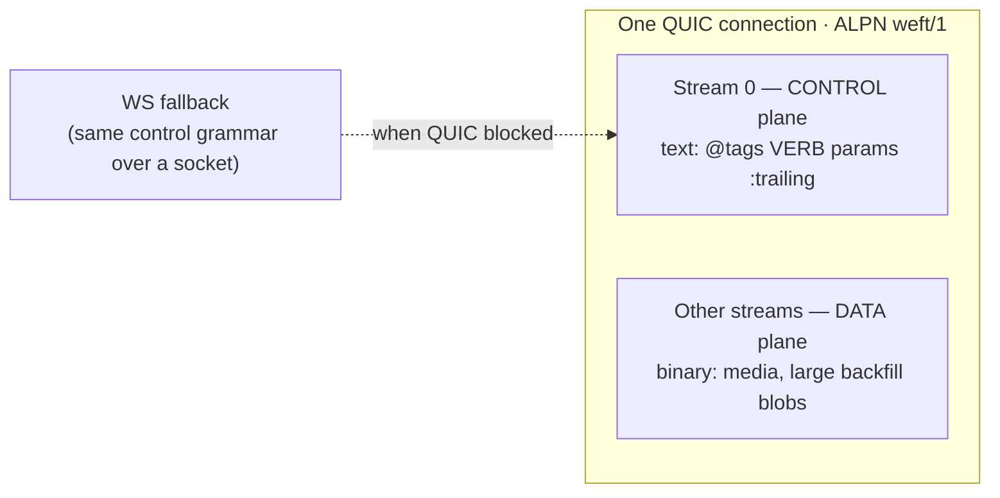

| Property | Value |
|----------|-------|
| Control grammar | `@tag=val VERB param1 param2 :trailing text` — line-oriented, **netcat-debuggable** (§4). |
| Data plane | Binary, out-of-band (media streams, large history offered as a `STREAM` token). |
| Parser rule | **Lenient-in, strict-out**: tolerate noisy-but-safe input; refuse to *emit* anything the parser would reject. |
| Unknown verbs | Become `Command::Unknown` — never an error (there is deliberately no `UNKNOWN-COMMAND`). |
| Correlation | Requests carry a `label`; the sender's **echo** of its own message is the ack (§3.5). |

---

## 2. Session lifecycle — the connection FSM

Every connection walks a small state machine. Three of the states are the ordinary
client path; two are federation (covered in the federation doc).

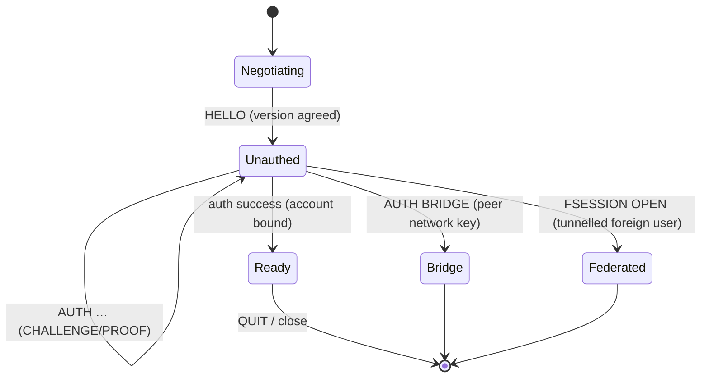

| State | Meaning | Who |
|-------|---------|-----|
| **Negotiating** | Version handshake (`HELLO`). | everyone |
| **Unauthed** | Awaiting credentials; may hold a pending challenge. | everyone |
| **Ready** | Authenticated local account — full client surface. | clients |
| **Bridge** | Authenticated *peer network* — carries federation traffic. | peer servers |
| **Federated** | A foreign user's command session tunnelled over a bridge (`Actor::Foreign`). | tunnelled users |

Liveness: per-connection `PING`/`PONG`; a slow consumer is detected (broadcast lag) and
pushed onto the backpressure path (`ERR SLOW` + forced HISTORY resync, invariant 6).

---

## 3. Auth & identity

Identity = **`user@network`** plus **Ed25519 device attestations** (§10). Registration
and every login share a uniform, anti-oracle shape.

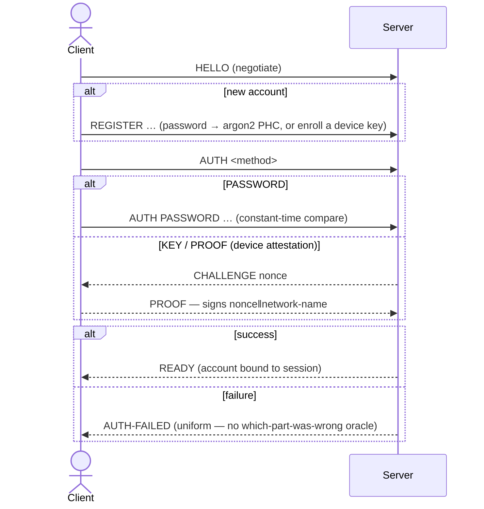

| Method | Proof | Anti-abuse |
|--------|-------|-----------|
| `PASSWORD` | argon2 PHC hash, **constant-time** compare. | Uniform `AUTH-FAILED`. |
| `KEY` / `PROOF` | Ed25519 signature over `nonce‖network-name`. | Network name in the signed payload blocks **cross-network replay** (invariant 5). |
| `ENROLL` | Adds a new device attestation. | Rotation = a superseding attestation (§10.2). |
| `BRIDGE` | Peer proves its **network** key. | → `State::Bridge` (federation). |

Optional **verification claims** (§10.5): `VERIFY EMAIL/CONFIRM/BIRTHDAY/LIST` → a
`VERIFIED` badge. Email = mailed-code proof (SMTP `Mailer` port); birthday =
self-attested. Badge-only — no access gating yet.

---

## 4. Channels & messaging

Channels are the core surface. A client `JOIN`s, then `MSG`s; the **channel actor** is
the single writer that assigns ULIDs (per-channel total order, §9.1).

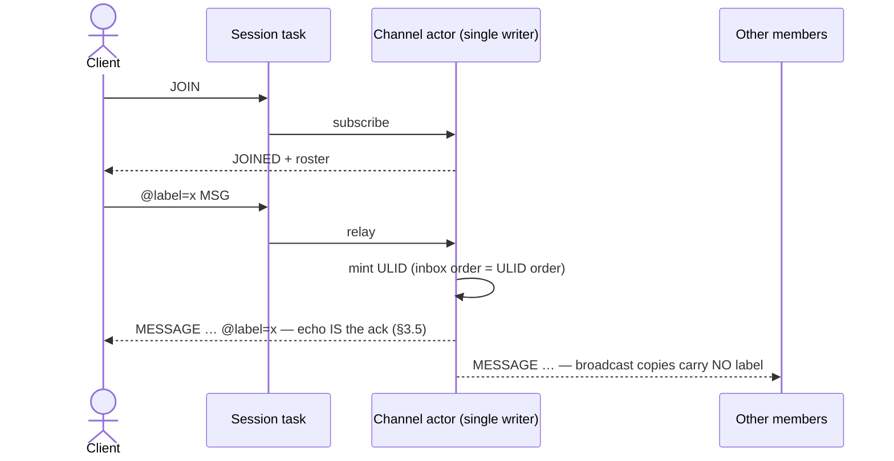

| Rule | Statement |
|------|-----------|
| **Single writer** | Only the channel actor mints msgids. Never mint elsewhere. |
| **Label ack** | Echo the label on every **direct** response (incl. `ERR`); **never** on broadcast copies (§3.5). |
| **Dedup** | Retried `MSG`s are deduped by `(session, label)` in a 5-minute window (§9.2). |
| **Retention** | Each channel carries a policy: `ephemeral` \| `retained:<d>` \| `permanent` \| `e2ee` (§5.2). |
| **DMs** | `MSG @user :…` routes through the account **directory** actor rather than a channel. |
| **Typing / presence / marks** | `TYPING`, `PRESENCE`, `MARK` (read cursor) + `MARKED` snapshot (§9.7). |

Retention shapes what is even stored:

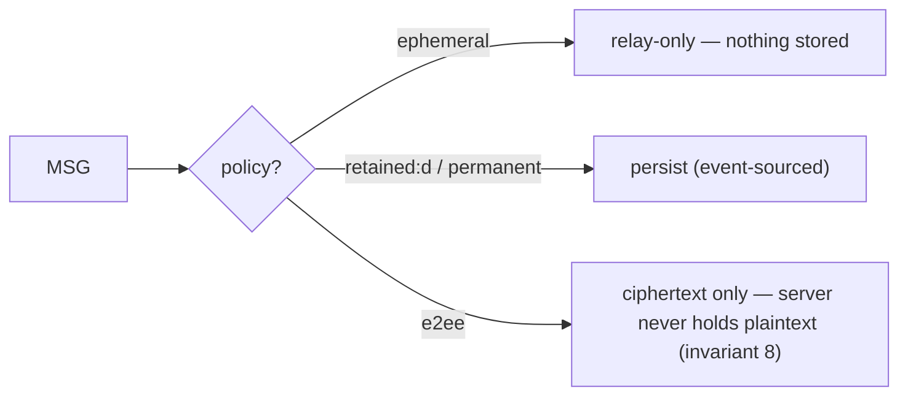

---

## 5. Message mutations (EDIT / DELETE / REACT)

Edits, deletes, and reactions are **events**, not in-place rewrites — the live path
stays event-sourced; the compacted form is derived (§12.1).

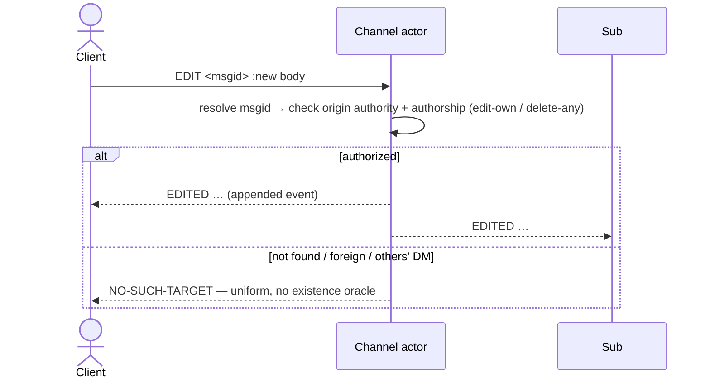

| Op | Authority | Notes |
|----|-----------|-------|
| `EDIT` | Author (`edit-own`) or `edit-any` cap. | Appends; final body wins in materialization. |
| `DELETE` | Author (`delete-own`) or `delete-any` cap. | Tombstone wins over everything (content gone). |
| `REACT` / `UNREACT` | Any member. | Idempotent per `(emoji, actor)`; summarized as `REACTIONS`. |

**Materialization** (one shared pure function, both storage backends): event rows →
one `MESSAGE` per surviving message (`edited=` count), per-emoji `REACTIONS`, and
`DELETED` tombstones. Batches never carry `EDITED` chains or reaction ping-pong
(invariant 10).

---

## 6. History & backfill

This is the most-asked-about flow, so it gets a full walk-through. Reading history has
three separable pieces: **what you ask for** (a page), **what comes back** (a `BATCH` of
*compacted* events), and **how it's carried** (inline on the control plane, or — for a
big page — a one-line token plus a bulk pull on the data plane). Backfill is the same
machinery pointed at a peer or a group's home instead of the local store.

### 6a. What you ask for — a page

```
HISTORY <target> [before=<msgid>] [after=<msgid>] [limit=<n>] [thread=<root>]
```

A page is **newest-anchored with exclusive cursors**: the last `limit` roots *strictly
between* `after` and `before` (either cursor may be omitted). `limit` caps at 500. So
"the latest 50" is `limit=50`; "50 older than what I have" is `before=<oldest I hold>`;
"anything after my newest" (the reconnect/catch-up query) is `after=<newest I hold>`.
`thread=<root>` narrows to a single thread (root + its replies).

### 6b. What comes back — a compacted `BATCH`

The server reads the roots + their child events and **materializes** them into the
*compacted* wire form (§12.1, invariant 10) — then frames them:

```
BATCH START <id>
  … one event per surviving item …
BATCH END <id>   (truncated? compacted)
```

Every line — the brackets **and** each item — echoes the request `label`, because a
batch is a data page, not a broadcast (§3.5). The items are **not** the raw event log.
Materialization collapses each message's whole history into at most one line:

| Raw log had… | The batch carries… |
|---|---|
| a message + 2 edits | **one** `MESSAGE` with the final body + `edited=2` `edited-at=<ms>` |
| N reacts/unreacts on a message | **one** `REACTIONS <msgid> <emoji> <count>` per emoji (`by=` lists ≤20 actors) |
| a message that was deleted | **one** `DELETED <msgid>` tombstone — the content is gone |

So a batch never contains `EDITED` chains or reaction ping-pong; a client renders each
item directly.

**Worked example — inline (small page):**

```
C: @label=h1 HISTORY #general limit=3
S: @label=h1 BATCH START b7
S: @label=h1 MESSAGE #general alice@test.example :final text   msgid=test.example/01J…A edited=1 edited-at=1737…
S: @label=h1 REACTIONS #general test.example/01J…A 👍 3         by=alice@test.example,bob@test.example,carol@test.example
S: @label=h1 DELETED #general test.example/01J…B               by=bob@test.example
S: @label=h1 MESSAGE #general carol@test.example :ok           msgid=test.example/01J…C
S: @label=h1 BATCH END b7   truncated compacted
```

Three surviving items: an edited message (shown once, final body, `edited=1`), a reaction
summary, and a tombstone — from what may have been a dozen raw log rows.

### 6c. How it's carried — inline vs. the data-plane switch

A batch's *content* is fixed; only its *transport* changes with size (`HISTORY_STREAM_THRESHOLD` = **200** events):

| Page size | Transport | What the control plane carries |
|---|---|---|
| ≤ 200 events | **inline** | the `BATCH START … BATCH END` lines themselves, one control line each |
| > 200 events | **data-plane `STREAM`** | *just* a `STREAM ACCEPT <token>` — one line, no events |

On the switch, the server serializes the **entire batch once** (the identical
`BATCH START … BATCH END` lines, newline-delimited) and parks it under a **one-time
token**. The client pulls it over the data plane; what comes back is **byte-identical**
to the inline form and folds the same way:

```
C: @label=h2 HISTORY #general limit=500
S: @label=h2 STREAM ACCEPT s_9f3c…            ← control plane: only the token, no events
   ── client opens a data-plane stream ──
C: BACKFILL s_9f3c…                            ← QUIC bidi   (HTTP alternative: GET /backfill?t=s_9f3c…)
S: (data plane) BATCH START b8 ⏎ MESSAGE … ⏎ … ⏎ BATCH END b8   ← the same batch, pulled in bulk
```

**The one thing to remember:** switching to the data plane moves the *bytes*, not the
*meaning*. The control plane stays responsive (it only carried a token); the bulk rides
a stream that's independently flow-controlled and rate-limitable. The token is one-time —
a failed pull is recovered by re-issuing the same `HISTORY` (you get a fresh token).

### 6d. The three backfill flavors (all produce the same `BATCH`)

```mermaid
sequenceDiagram
  actor U as Client
  participant S as Home server
  participant P as Peer / group home
  U->>S: HISTORY <target> …
  S->>S: roots(scope, page) → materialize → BATCH (inline or STREAM token)
  S-->>U: BATCH  (or STREAM ACCEPT → data-plane pull)
  opt short page on a shared (federated) channel — §11.7
    S->>P: HISTORY over the bridge → BACKFILL <token> on the bridge data plane
    P-->>S: same window; S persists + broadcasts, next page is local
  end
  opt cross-network group view — recovery
    S->>P: GROUP BACKFILL &group @after=<cursor>
    P-->>S: GROUP RELAY ingests for missed messages (idempotent)
  end
```

| Flavor | Trigger | Source | Mechanism |
|---|---|---|---|
| **Local scrollback** | any `HISTORY` | your own store | roots → materialize → BATCH (§6b–c) |
| **Federated channel backfill** (§11.7) | a short page on a *shared* channel | the peer, over the bridge | server lazily re-runs the window as `HISTORY` on the bridge, pulls it with `BACKFILL <token>`, verifies + persists → the next page serves locally |
| **Group backfill** (recovery) | viewing a *cross-network group* | the group's **home** | `GROUP BACKFILL @after=<my newest>` → home replays missed messages as `GROUP RELAY` ingests (idempotent on msgid) — see federation doc §7b |

| Concept | Meaning |
|---------|---------|
| **Newest-anchored** | The last `limit` roots strictly between `after` and `before`. |
| **`truncated`** | Set honestly when the window ran out **and** its older edge reaches into the purged region (a real retention gap) — **not** merely when the page was full. A client renders it as a visible "history missing here" marker. |
| **`compacted`** | Always set on a HISTORY batch: this is the materialized view, not the raw log. |
| **`thread=<root>`** | Returns just that thread (root + replies), §9.4. |

---

## 7. Capabilities — the permission model

There are **no role tables**. Permission = a **scoped, signed capability token**
(deterministic CBOR, delegation chains, short expiry + refresh, revocation epochs,
§10.4). Same-network grants are also recorded server-side so caps are checkable without
a round-trip.

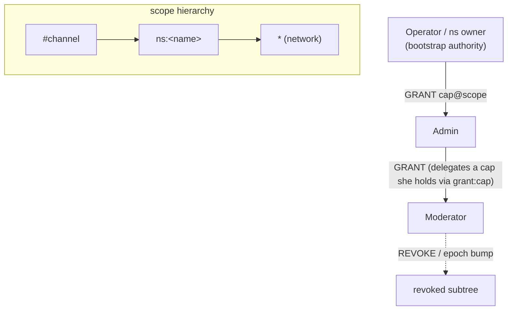

| Rule | Statement |
|------|-----------|
| **Caps precede side effects** | Verify the token chain **before** mutating anything (invariant 4). |
| **Scope covering** | A check at `#chan` is satisfied by a grant at `#chan`, its `ns:`, or `*`. |
| **Bootstrap** | Config `operators` hold every cap at `*`; a namespace owner holds every cap in `ns:<name>`. |
| **Revocation** | `REVOKE` + monotonic **epoch** invalidates a token subtree without chasing every copy. |

Verbs: `GRANT` / `REVOKE`; delegation via `grant:<cap>`. Invites are cap-bearing:
`INVITE MINT/REVOKE/REDEEM` (scoped, use-limited, expiring).

---

## 8. Namespaces — user-owned servers

A namespace is a Discord-style "server": user-owned, with a visibility tier and a
channel layout. The owner is the `ns:<name>` scope authority (the namespaced analog of
operators).

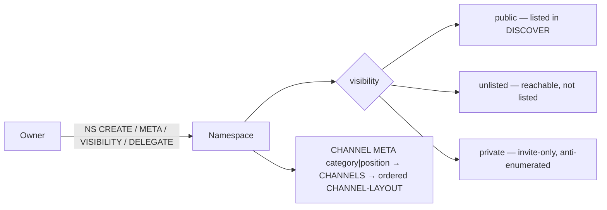

| Flow | Verbs |
|------|-------|
| **Lifecycle** | `NS CREATE / META / VISIBILITY / DELEGATE / DELETE`. |
| **Discovery** | `DISCOVER` → public namespaces (private/unlisted never leak — invariant 1). |
| **Layout** | Categories + ordering: `CHANNEL META <#chan> category\|position`; `CHANNELS <ns>` → `CHANNEL-LAYOUT` sorted by (category, position, name). |
| **Channels** | `CHANNEL CREATE / POLICY / META / DELETE`; lazy actor spawn; namespaced `#ns/chan`. |

---

## 9. Moderation — mute / ban / kick / restricted posting

Two composed surfaces produce one predicate: **`can_post = ¬muted ∧ ¬banned ∧ (open ∨ has send)`**.

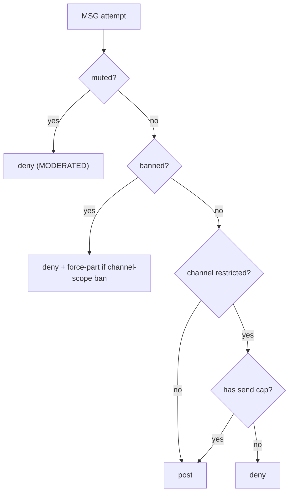

| Surface | Mechanism |
|---------|-----------|
| **Deny-list** | `MUTE`/`UNMUTE` (deny `send`), `BAN`/`UNBAN` (deny join+send), `KICK <#chan>`, keyed `(scope, account)`, cap-gated by `mute`/`ban`/`kick`. |
| **Scope = who moderates** | `*` = network mods, `ns:` = namespace mods, `#chan` = channel mods (covering rules apply). |
| **Restricted posting** | `CHANNEL META <#chan> posting :restricted` → posting requires `send`; `GRANT`/`REVOKE send` governs speech. |
| **Effects** | A channel-scope ban force-parts (actor `Eject` + session cleanup); `MODERATED` renders as a system line. |

---

## 10. Recovery ladder — never a silent root rotation

Namespace ownership can be recovered without ever allowing a *silent* seizure. Every
rung is announced and audit-marked; delayed rungs are cancellable by the root.

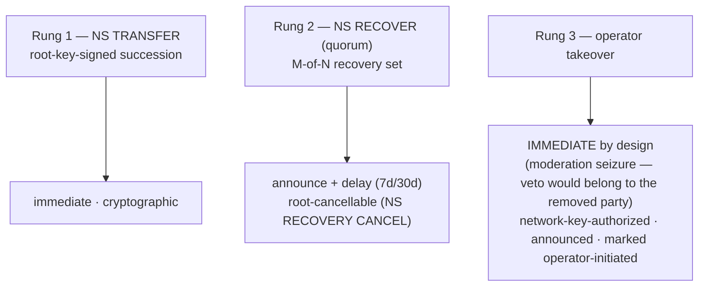

| Invariant | Statement |
|-----------|-----------|
| Every delayed rung | announcement + delay + root-cancellable. |
| Rung 3 | immediate, but network-key-authorized, announced, permanently marked in `root-history`. |
| The constant | **No silent root rotation path may exist** — announcement + audit mark survive every rung. |

Verbs: `NS TRANSFER`, `NS RECOVERY SET`, `NS RECOVER`, `NS RECOVERY CANCEL`; the crypto
`rotation` module signs transfers/rotations/cancels.

---

## 11. Reports — moderation intake with confidentiality

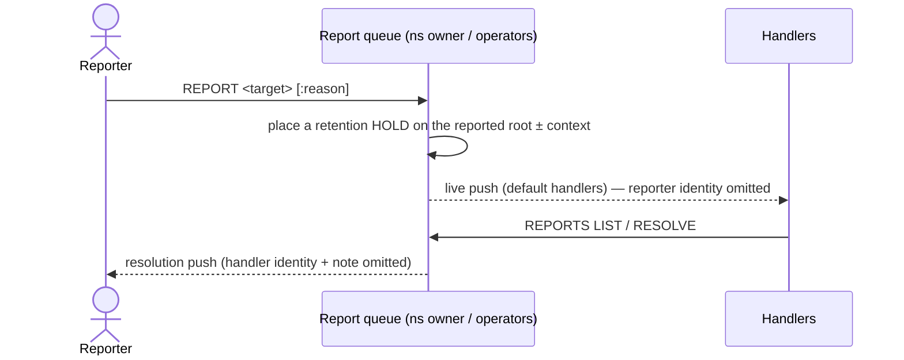

| Concept | Statement |
|---------|-----------|
| **Routing** | ns / net scope; `csam` / `illegal` **dual-route** to operators. |
| **Content states** | `verified` (same-network), `unverified` / `reporter-attested` (federated/e2ee) — marked **honestly**, never fabricated. |
| **Retention holds** (invariant 11) | Reported root ± context (radius 25) are exempt from purge **and** compaction until resolution + grace; invisible on every protocol surface. |
| **Reporter confidentiality** (invariant 12) | Reported party learns nothing; forwarded reports strip reporter identity by default. |

---

## 12. Media

Media is **content-addressed** (BLAKE3 hash), stored out-of-band, referenced by a
`weft-media://<network>/<hash>` URI, and streamed over the data plane.

```mermaid
sequenceDiagram
  actor U as Uploader
  participant S as Server
  U->>S: STREAM upload → blob stored by BLAKE3 hash
  S-->>U: weft-media://net/<hash>
  U->>S: MSG … (attachment = the URI)
  Note over S: recipients STREAM-pull by hash; dedup is automatic (same bytes = same hash)
  opt cross-network attachment
    S->>Origin: mirror pull from the blob's ORIGIN network (§11.8)
  end
```

| Property | Statement |
|----------|-----------|
| **Content addressing** | Identical bytes collapse to one blob; the hash is the integrity check. |
| **Mirroring** (§11.8) | A foreign attachment is pulled from its **origin** network so local members can fetch it; hash moderation applies. |
| **Backfill-over-STREAM** | Large history pages ride the same data-plane pull as media. |

---

## 13. Social layer — friends, group DMs, calls

The social layer is keyed on **`account@network`** so every piece federates (details in
the federation doc §9). Single-network flows:

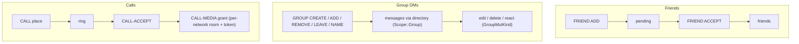

| Flow | Verbs / mechanism |
|------|-------------------|
| **Friends** | `FRIEND ADD/ACCEPT/REMOVE`, `FRIENDS`. |
| **Group DMs** | `GROUP CREATE/ADD/REMOVE/LEAVE/NAME`, `GROUPS`; messages minted single-writer like DMs (`Scope::Group`). |
| **Group mutations** | edit / delete / react via the directory, materialized like channel messages. |
| **1:1 & group calls** | `CALL` / `GROUP CALL` → per-network LiveKit room + `CALL-MEDIA` credential + roster; cross-network legs bridge via the relay (§14). |

---

## 14. Voice

Voice channels are a **distinct voice-only channel kind**, advertised separately and
invisible to the IRC projection. The media plane is **LiveKit**; single-network calls
join one room, cross-network calls cascade through server-to-server **relays** so client
IPs never cross (see federation doc §10).


| Property | Statement |
|----------|-----------|
| **Distinct kind** | Voice channels are voice-only, advertised apart from text; server-side, invisible to IRC. |
| **Credential** | `CALL-MEDIA` carries the room + a minted token scoped to that participant. |
| **Relay is integral** | Part of the `voice` feature; always in the media path for cross-network (never optional). |

---

## 15. IRC gateway (WEFT-IRC, §17)

An RFC 2812 front-end exposed as an ordinary `ControlStream` — it **translates IRC↔WEFT
at the line boundary**, so the normal session FSM/actors/store drive it. A projection,
not a parallel server.

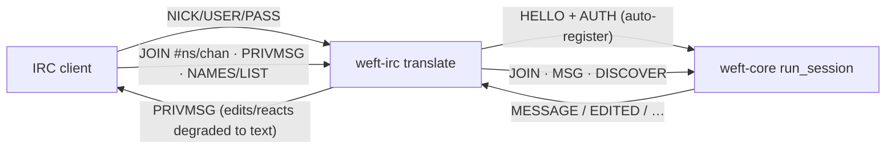

| Mapped | Degraded / deferred |
|--------|--------------------|
| NICK/USER/PASS→HELLO+AUTH, JOIN/PART (incl. `#ns/chan`), PRIVMSG↔MSG (bare nick = DM), NAMES, LIST←DISCOVER, PING/PONG/QUIT/MOTD. | Edits/deletes/reactions rendered as text (`* edited:`); SASL, IRCv3 tags, chathistory, MODE/TOPIC/KICK projection are deferred. Voice + e2ee invisible. |

---

## 16. Federation (summary)

Sovereign networks; explicit **signed manifest peering**; every event **≤ 1 hop** from
origin; the **home** mints order (single writer). Trust is network-level (a peer proves
its Ed25519 network key), pinned or accept-any, with name-keyed **NETBLOCK** as the
escape hatch. A stack of control-plane tunnels multiplex on one authenticated bridge
session — manifest control, the event mirror, history backfill, report forwarding, and
the FSESSION conduit (homeserver-authority admin **and** the fire-and-forget social layer
via FriendDeliver) — plus two separate media planes (content-addressed blob mirroring and
the voice-relay cascade for IP-safe cross-network audio). The full side-by-side inventory
with directions is spec §11 / `weft-federation-flows.md` §3.

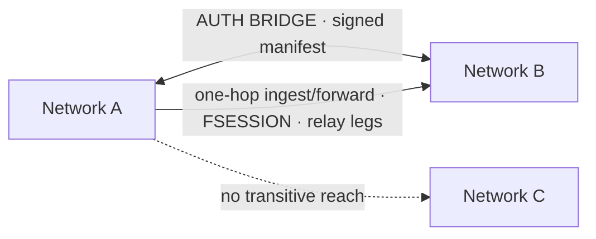

**→ Full detail: `weft-federation-flows.md`.**

---

## Appendix A — the error model (anti-enumeration)

The single most important cross-cutting rule (invariant 1): **`NO-SUCH-TARGET` is the
one code** for nonexistent / private-unmember / view-gated / expired-msgid / dead-invite
— identical code, identical timing envelope. Any pre-error branch on hidden-vs-absent is
a bug. There is no `UNKNOWN-COMMAND`. `AUTH-FAILED` is uniform.

| Situation | Answer |
|-----------|--------|
| Channel/ns doesn't exist | `NO-SUCH-TARGET` |
| Exists but private and you're not a member | `NO-SUCH-TARGET` (identical) |
| View-gated and you lack `view` | `NO-SUCH-TARGET` (identical) |
| Expired msgid / dead invite | `NO-SUCH-TARGET` (identical) |
| Foreign msgid we can't authorize | `FORBIDDEN "origin"` (no existence oracle) |
| Missing capability | `CAP-REQUIRED <cap>` |
| Auth wrong (any part) | `AUTH-FAILED` (uniform) |
| Backpressure | `SLOW` + forced resync |

## Appendix B — security invariants (all implemented as tests)

| # | Invariant | Flow it guards |
|---|-----------|----------------|
| 1 | Anti-enumeration | §4, §8, §11 — one code, one timing envelope. |
| 2 | Origin authority | §5, §16 — only the origin edits/deletes; bridged msgids preserved. |
| 3 | Manifest gating | §16 — forward only acked-manifest scopes. |
| 4 | Caps precede side effects | §7 — verify the chain before mutating. |
| 5 | Auth replay-proof | §3 — proofs sign `nonce‖network-name`; constant-time compares. |
| 6 | Backpressure | §2 — slow client → `SLOW` + resync, never unbounded buffering. |
| 7 | NETBLOCK name-keyed | §16 — rotation can't evade; four effects together. |
| 8 | E2EE unrepresentability | §4 — no code path holds plaintext for an e2ee channel. |
| 9 | Recovery ladder | §10 — no silent root rotation; every path announced + audited. |
| 10 | Compaction | §5 — batches carry compacted form, never edit chains / reaction ping-pong. |
| 11 | Retention holds | §11 — reported content exempt from purge + compaction, invisibly. |
| 12 | Report confidentiality | §11, §16 — reporter identity never leaks. |
| 13 | Auto-federation SSRF | §16 — auto-bridge dialer refuses non-public targets. |

*Normative source: `weft-protocol-spec.md`. Architecture rationale:
`weftd-server-architecture.md`. Federation deep dive: `weft-federation-flows.md`.*
